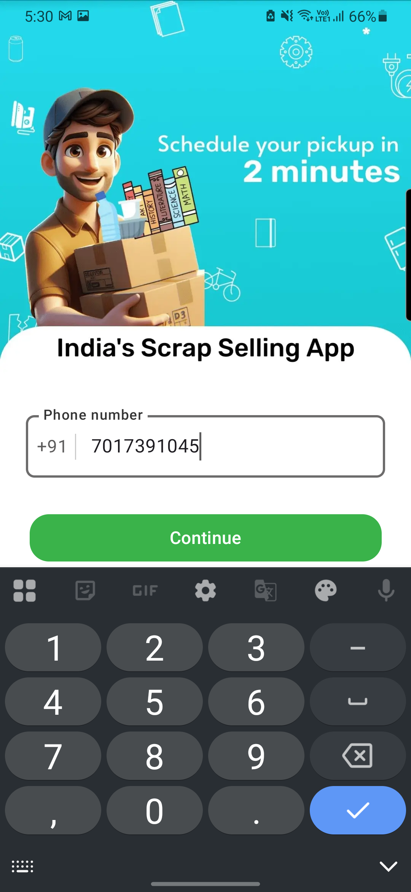
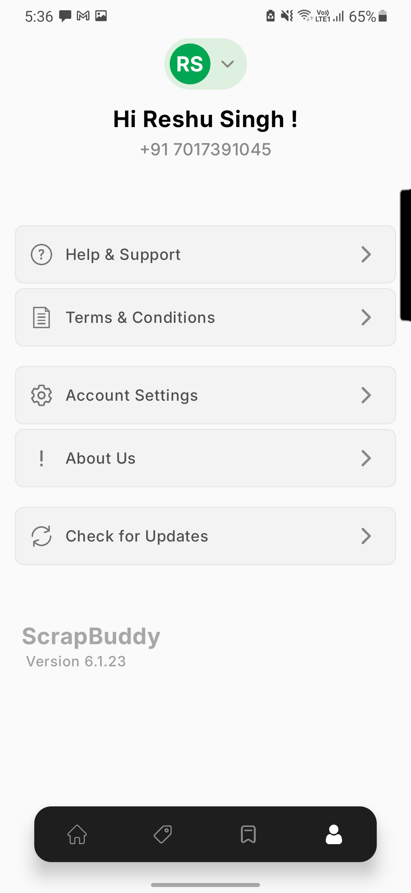
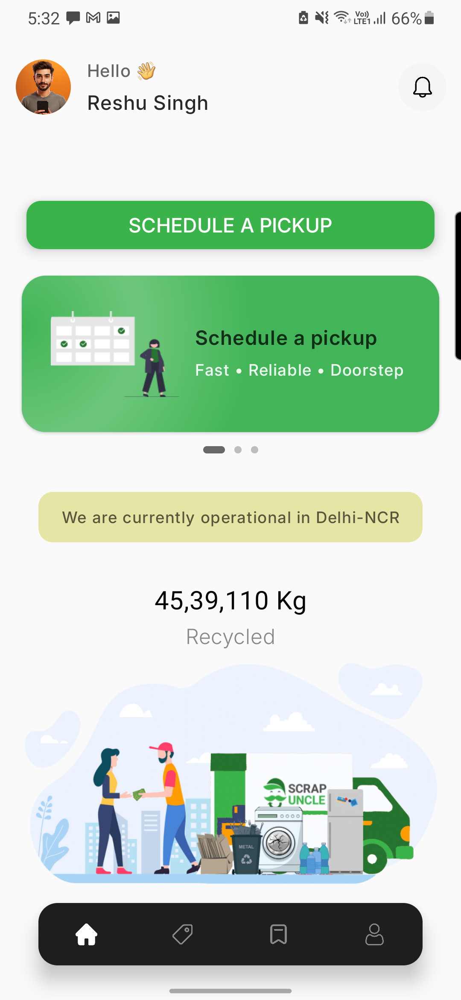
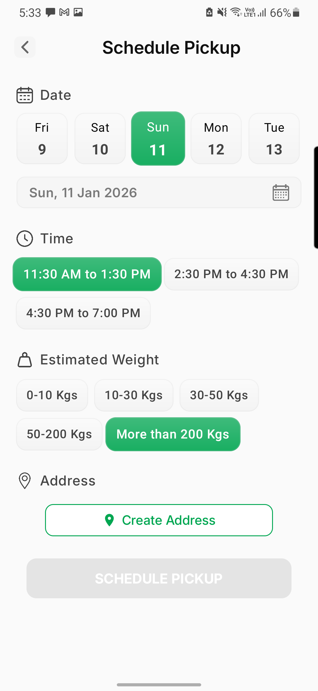
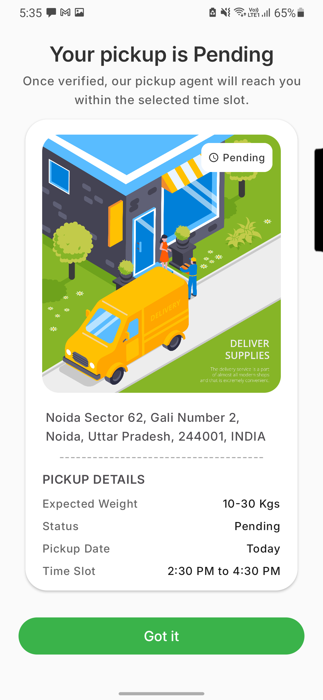
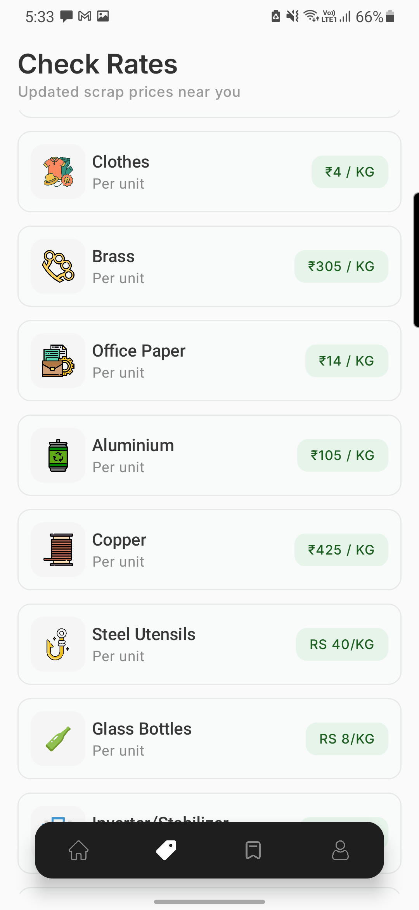

# ScrapBuddy

ScrapBuddy is an Android application that allows users to schedule scrap pickups from their homes. Users can view scrap prices, request pickups, and track pickup status easily.

The app is built using modern Android development practices including **Kotlin**, **Jetpack Compose**, **MVVM architecture**, and **Firebase backend services**.

# App Demo

https://github.com/user-attachments/assets/cd1096de-aabd-4e6b-86ae-94b2d3bacc36
 
 
 ## 📸 Screenshots

| Login | Create Profile | Home |
|------|------|------|
|  |  |  |

| Schedule Pickup | Pickup Status | Scrap Rates |
|------|------|------|
|  |  |  |

## Architecture Overview

The application follows **MVVM (Model-View-ViewModel)** architecture with a repository layer to maintain separation of concerns.

UI (Jetpack Compose)
        │
ViewModel
        │
Repository
        │
Firebase Services

## Benefits

• Clear separation between UI and business logic
• Scalable architecture
• Easier testing and maintenance

## App Flow

1. User logs in using phone authentication
2. Creates a profile
3. Views scrap prices
4. Schedules a scrap pickup
5. Tracks pickup request status

## Features

• Phone number authentication using Firebase  
• User profile creation and management  
• Scrap price listing  
• Schedule scrap pickup requests  
• Track pickup request status  
• Address management system  
• Modern UI built with Jetpack Compose  

## Tech Stack

#### Android

• Kotlin
• Jetpack Compose
• Material Design 3

#### Architecture

• MVVM Architecture
• Repository Pattern

#### Backend

• Firebase Authentication
• Firebase Firestore

#### Async Handling

• Kotlin Coroutines
• Compose State Management

## Author

Reshu Singh  
Android Developer

GitHub: https://github.com/reshusingh07
 
LinkedIn: https://www.linkedin.com/in/reshu-singh07/

